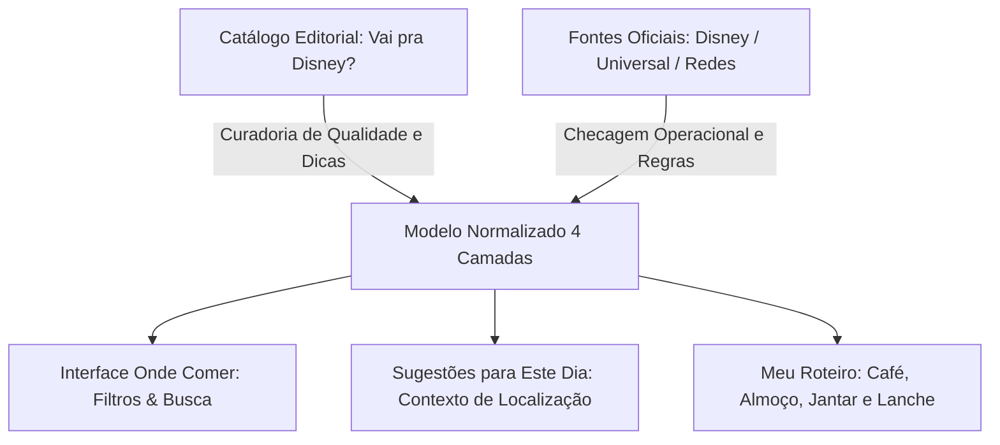

# 🍽️ Hub Gastronômico — Guia Onde Comer em Orlando
*Metodologia editorial, separação operacional, procedimentos de reserva e integração com o Orlando Planner.*

---

## 📌 1. Visão Geral do Sistema Gastronômico

A funcionalidade **Onde Comer** do **ORLANDO PLANNER** foi projetada como uma ferramenta real de planejamento e suporte à decisão alimentar durante viagens a Orlando. A curadoria inicial utiliza como referência editorial a seção de alimentação do conceituado portal brasileiro [Vai pra Disney?](https://www.vaipradisney.com/blog/comida/), complementada por verificações operacionais oficiais das operadoras Disney, Universal, SeaWorld e estabelecimentos independentes.

---

## ⚖️ 2. Separação Obrigatória: Editorial vs. Operacional

Um dos pilares da arquitetura do Orlando Planner é a separação rigorosa entre impressões editoriais e fatos operacionais:

| Dimensão | Informação Editorial | Informação Operacional Confirmada |
| :--- | :--- | :--- |
| **Origem** | Avaliações do *Vai pra Disney?*, colunas, receitas, matérias antigas. | Páginas oficiais da Disney, Universal, SeaWorld, Chick-fil-A, etc. |
| **Conteúdo** | Opinião, pratos recomendados, custo-benefício percebido, atmosfera. | Horários em vigor, necessidade de reserva, preços atuais, funcionamento. |
| **Validade** | Permanente como registro histórico de experiência. | Transitória; sujeita a alterações operacionais e fechamentos. |
| **Regra no App** | Exibida em resumos curtos com link discreto para o artigo original. | Identificada com badges: `Confirmado`, `Pendente` ou `Fechado`. |

> [!WARNING]
> **Preços e Cardápios para Maio de 2027**: Nenhuma publicação histórica comprova cardápio ou preço para 2027. Os preços não confirmados são omitidos ou indicados como faixas estimadas (`$`, `$$`, `$$$`, `$$$$`), sem criação de valores numéricos fictícios.

---

## 📅 3. Cronograma de Reservas Disney (A Regra dos 60 Dias)

Para restaurantes com serviço de mesa (Table Service) e experiências com personagens na Disney e Universal:

1. **Janela de Abertura**: Abertura exatamente **60 dias antes** da data da refeição.
2. **Horário de Abertura**: Às **06:00 AM (Horário do Leste dos EUA / Eastern Time)**, tipicamente **07:00 AM (Horário de Brasília)**.
3. **Vantagem de Hóspedes Disney**: Hóspedes de hotéis do complexo Disney podem reservar para toda a sua estadia (até 10 dias) a partir do dia de check-in, o que garante acesso antecipado a disputados restaurantes como *Cinderella's Royal Table*, *Be Our Guest*, *Space 220* e *'Ohana*.
4. **Política de Cancelamento**: Cancelamentos sem multa permitidos com até 2 horas de antecedência na maioria dos restaurantes Disney (com exceção de experiências pré-pagas).

---

## 🗺️ 4. Mapa das Seções do Guia Gastronômico no Vault

- [[07.01 - Onde Comer no Magic Kingdom|07.01 — Onde Comer no Magic Kingdom]]
- [[07.02 - Onde Comer no EPCOT|07.02 — Onde Comer no EPCOT]]
- [[07.03 - Onde Comer no Disney's Hollywood Studios|07.03 — Onde Comer no Hollywood Studios]]
- [[07.04 - Onde Comer no Disney's Animal Kingdom|07.04 — Onde Comer no Animal Kingdom]]
- [[07.05 - Onde Comer no Universal Studios & Islands of Adventure|07.05 — Onde Comer na Universal & Islands]]
- [[07.06 - Onde Comer no Universal Epic Universe|07.06 — Onde Comer no Epic Universe]]
- [[07.07 - Guia de Restaurantes do Disney Springs & CityWalk|07.07 — Disney Springs & CityWalk]]
- [[07.08 - Refeições com Personagens Disney & Universal (Character Dining)|07.08 — Refeições com Personagens]]
- [[07.09 - Comer Bem e Barato Fora dos Parques & Dicas de Economia|07.09 — Fora dos Parques & Dicas Baratas]]

---

## 🛡️ 5. Proteção de Dados e Governança no Webapp

- **Deduplicação**: Identificadores canônicos e normalização por nome.
- **Auditoria**: Painel administrativo com contagem de artigos, status de extração e diferenças de versão.
- **Imutabilidade Pessoal**: Atualizações do catálogo oficial **jamais** sobrescrevem favoritos, notas pessoais ou refeições agendadas pelo usuário.
